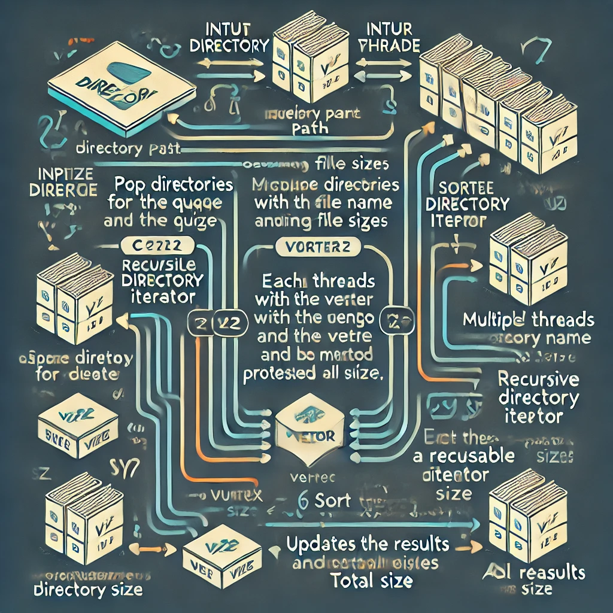

# Folder Size Summary Tool

## Overview

The Folder Size Summary Tool is a high-performance C++ program designed to quickly calculate and display the sizes of subdirectories within a specified directory. It's particularly optimized for use in Windows Subsystem for Linux (WSL) environments, but can run on any POSIX-compliant system.

It obtains around %40 improvement over using `du -sh | sort -rh`.

### Update

Using `main_64.cpp` takes a fraction of a second over the two other alternatives(!).

So, it takes 0.33 seconds to do the job using `main_win64.cpp` over either the general `main.cpp` (which was already optimised for WLS and Ubuntu), or the shell command  `du -sh | sort -rh`.

Remember: native solutions are better solutions.

I'm not going to change the rest of this Readme. I'm just going to say that after some effort and research and using native API, I went from ~1 minute to ~40 seconds to ~0.3 seconds.

### Best answer

```
$ cl /EHsc /W4 /std:c++17 main_win64.cpp
```

## Features

- Fast, multi-threaded directory size calculation
- Human-readable size output (B, KB, MB, GB, etc.)
- Sorts subdirectories by size in descending order
- Handles permission errors gracefully
- Provides a total size summary

## Requirements

- C++17 compatible compiler (e.g., GCC 7+ or Clang 5+)
- POSIX-compliant operating system (Linux, macOS, WSL, etc.)
- pthread library

## Compilation

To compile the program, use the following command:

```bash
g++ -O3 -march=native -mtune=native -pthread -std=c++17 folder_size_summary.cpp -o folder_size_summary
```

This command enables optimizations and multi-threading support.

## Design

This is what ChatGPT thought about my software design:



## Usage

Run the compiled program with a directory path as an argument:

```bash
./folder_size_summary /path/to/directory
```

Replace `/path/to/directory` with the actual path you want to analyze.

## Output

The program will output a list of subdirectories sorted by size in descending order, followed by a total size summary. For example:

```
1.5G    Downloads
985.3M  Documents
256.0M  Pictures
54.2M   Music
10.5M   Videos

Total size: 2.8G
```

## Performance Considerations

- The tool uses multi-threading to process directories in parallel, which can significantly speed up the analysis of directories with many subdirectories.
- It's optimized for WSL environments, taking into account potential I/O limitations.
- For very large directories or filesystems with millions of files, the tool may take longer to complete.

### Performance

I ran this on my locally downloaded complete copy of 138 GitHub repos, including all .git folders.

Overall, I got a %40 improvement in performance over using `du -sh | sort -rh`.

Hardware: 
* Serial ATA 6BG/s. 
* Original Device Name: ASMedia ASM1061 PCI-E x1 SATA 6Gbps Controller

I could run it again on my Host Controller:
* Samsung NVMe PCIe SSD Controller

But I haven't. Results should be similar in terms of percentage performance. For me, I just wanted to optimise for spinning disks. 

```bash
❯ fast_du_sort/profile.sh
Run #1:
fast_du_sort run #1 time: 56.139556722 seconds
du -sh | sort -rh run #1 time: 87.789694778 seconds
Progressive average time after 1 runs:
fast_du_sort average: 56.139 seconds
du -sh | sort -rh average: 87.789 seconds
-------------------------
Run #2:
fast_du_sort run #2 time: 56.311411533 seconds
du -sh | sort -rh run #2 time: 90.855049047 seconds
Progressive average time after 2 runs:
fast_du_sort average: 56.225 seconds
du -sh | sort -rh average: 89.322 seconds
-------------------------
Run #3:
fast_du_sort run #3 time: 54.069787063 seconds
du -sh | sort -rh run #3 time: 90.927077568 seconds
Progressive average time after 3 runs:
fast_du_sort average: 55.506 seconds
du -sh | sort -rh average: 89.857 seconds
-------------------------
Run #4:
fast_du_sort run #4 time: 57.467005665 seconds
du -sh | sort -rh run #4 time: 89.683100386 seconds
Progressive average time after 4 runs:
fast_du_sort average: 55.996 seconds
du -sh | sort -rh average: 89.813 seconds
-------------------------
Run #5:
fast_du_sort run #5 time: 55.003843940 seconds
du -sh | sort -rh run #5 time: 90.371428816 seconds
Progressive average time after 5 runs:
fast_du_sort average: 55.798 seconds
du -sh | sort -rh average: 89.925 seconds
-------------------------
Final Results after 5 runs:
fast_du_sort average: 55.798 seconds
du -sh | sort -rh average: 89.925 seconds
```

## Error Handling

- The program will skip files and directories it doesn't have permission to access.
- If the specified path is not a directory, the program will display an error message and exit.

## Limitations

- Symbolic links are not followed to prevent potential infinite loops.
- The tool currently only summarizes immediate subdirectories of the specified path, not the entire directory tree.

## Contributing

Contributions to improve the tool are welcome. Please submit pull requests or open issues on the project's GitHub repository.

## License

This tool is released under the MIT License. See the LICENSE file for details.
